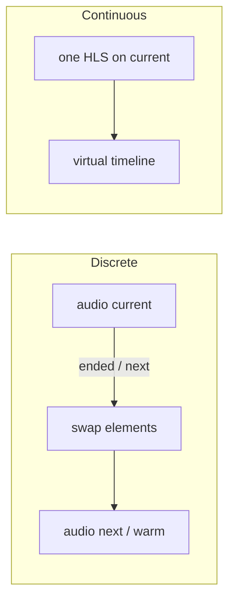

# AudioEngine API

This is the host-facing reference for `@homeweblab/audio-engine`. The README covers install and a short example; this document explains **what each method does, why it exists, and when to call it**.

If you are wiring this from `webfront-dev` (`EnginePlayer`), start with [Lifecycle](#lifecycle) and [`unlock()`](#unlock).

---

## Mental model

`AudioEngine` is a **playback controller**, not a player UI and not your API client.

| Piece | Who owns it | Role |
|---|---|---|
| `SourceAdapter` | Your app | Maps track / queue ids → URLs + metadata |
| `AudioEngine` | This package | Dual `<audio>` pool, discrete vs continuous modes, events, Media Session |
| Host (`EnginePlayer`, etc.) | Your app | User gestures, playlists, UI state |

Two playback modes share one public class:

- **Discrete** — one URL per track. The engine keeps a *current* `<audio>` and a *next* (warm) `<audio>`. Crossing a track boundary can swap elements instead of tearing down and reloading. In scope for desktop and iOS **foreground**; iOS **background** auto-advance is continuous HLS.
- **Continuous** — one queue-level HLS playlist plus a virtual timeline of track durations. Seeking “to the next track” is a seek on the same media clock.

The engine never knows your REST schema. It only calls `adapter.resolve()` / `adapter.resolveContinuous()`. Track `ids`, discrete `queueId`, and continuous `queueKey` are **opaque strings**: the engine stores them and hands them back to the adapter (or echoes `queueId` on `trackchange`). See the README “Opaque ids” example.

---

## Lifecycle

Typical order in the browser:

```
new AudioEngine(options)
  → setAdapter(adapter)
  → setMediaSessionActions({ ... })  // optional; host UX on headset / lock screen
  → mount()                  // onMount / first client render
  → unlock()                 // inside a click/tap handler
  → load({ ... autoplay })   // attach source and optionally play
  → play / pause / seek / next / previous / playAt
  → destroy()                // onDestroy
```

`load()` tears down the previous mode. Switching discrete ↔ continuous, or loading a different queue, is always a new `load()`.

SSR: construct the engine on the server if you want, but **`mount()` / `load()` / `unlock()` need `document`**. `ensurePool()` will throw if you call them during SSR.

---

## `unlock()`

```ts
await engine.unlock(): Promise<void>
```

This is **not** a lock, mutex, DRM, or “allow playback” flag in the app sense. It primes both `<audio>` elements so later `play()` calls can succeed **without** a user gesture (Safari / iOS, and some other autoplay policies).

### Why it exists

Browsers treat `HTMLMediaElement.play()` as privileged. The first `play()` usually has to run on the same call stack as a user gesture (click, tap, key). After that, **that specific element** is often allowed to autoplay.

This engine uses **two** elements (`current` + `next`). When track N ends, it may swap and call `play()` on the element that was sitting in the warm slot. That swap is **not** a user gesture. If that second element was never played during a gesture, iOS will reject the autoplay and the queue stalls.

`unlock()` primes both paused elements with a muted play/pause cycle, preserving their existing position and mute setting. Already playing elements are left running:

1. Mark the pool as unlocked (idempotent after the first call).
2. For each paused element: save position/mute → `muted = true` → `play()` → `pause()` → restore position/mute. Internal play/pause events are ignored by the modes.
3. Ignore failures. If the silent play is blocked, the next real `play()` still has to be gesture-driven.

After a successful unlock, later track swaps and `load({ autoplay: true })` can start audio without another tap.

### Why calling it from a click handler matters

`EnginePlayer.playTrack()` / `playQueueHls()` call `unlock()` **before** `load()` because those methods run from a user click. That is the window in which the silent `play()` is allowed.

```ts
await this.engine.unlock();
await this.engine.load({ mode: "discrete", ids, startIndex, autoplay: true });
```

If you only call `unlock()` later (timer, `trackchange` handler, prefetch callback), the silent play is often blocked, and the method still marks the pool “unlocked”. Prefetch of the warm slot then proceeds, but autoplay on swap may still fail.

### Side effects you will not see in the method body

The boolean `pool.isUnlocked` is set at the start of `unlock()` to indicate priming has been attempted. Concurrent calls await the same internal cycle before starting real playback; the flag does not prove the browser permitted autoplay. Discrete prefetch **attaches** the next `src` without waiting for unlock (buffering does not need a gesture). Call `unlock()` from the play click so iOS allows autoplay on that swap.

### When you do **not** need to call it

`play()` and internal `safePlay()` also call `unlock()`. That covers “user hit Play on an already loaded queue”. Hosts that start playback with `load({ autoplay: true })` from a gesture should still call `unlock()` first so **both** elements are primed before a real `src` is attached.

Call `unlock()` **before** `load()` when possible so both elements can be primed directly from the gesture. If a source is already loaded, unlock preserves its position and mute setting.

Subsequent calls await the first cycle if it is still in progress, then become no-ops.

---

## Constructor

```ts
new AudioEngine(options?: AudioEngineOptions)
```

Does not create DOM nodes. Safe on the server.

### `AudioEngineOptions`

| Field | Default | Meaning |
|---|---|---|
| `prefetch.enabled` | `false` | Opt-in. Discrete: warm next track on `beforeend`. Continuous: enlarge HLS ahead-buffer near track end. |
| `prefetch.progressiveSeconds` | `12` | Unused by discrete prefetch (browser readahead). Kept for the exported `warmProgressiveRange` helper. |
| `prefetch.hlsAheadSeconds` | `15` | Discrete HLS warm buffer cap; also feeds continuous ahead-buffer math. |
| `prefetch.defaultBitrate` | `1_000_000` (bits/s) | Unused by discrete prefetch. Used by `warmProgressiveRange` when `byteRateHint` is missing. |
| `hooks.beforeEndSeconds` | `5` | Fire `beforeend` once when this many seconds remain on the **current logical track**. |
| `hooks.progressPercents` | `[]` | Fire `progress` once per threshold (e.g. `[30, 90]`) as playback crosses that percent. |
| `hls.withCredentials` | `true` | Cookies / credentialed HLS XHR. Also sets `<audio crossOrigin="use-credentials">`. |
| `timeupdateIntervalMs` | `250` | Engine `timeupdate` is a timer, not the DOM `timeupdate` event. Unchanged clock snapshots are skipped; seek / play / pause always emit. |

Prefetch is off until you set `prefetch.enabled: true`. You do not need to call `prefetchNext()` yourself unless you want to warm earlier than `beforeend`.

---

## `SourceAdapter`

```ts
engine.setAdapter(adapter: SourceAdapter): this
```

Required before `load()`. Chainable.

```ts
interface SourceAdapter {
  resolve(id: string, ctx: ResolveContext): Promise<ResolvedTrack>;
  resolveContinuous?(queueKey: string, ctx: ResolveContext): Promise<ResolvedContinuous>;
}
```

### `resolve` (discrete)

Called when the engine actually needs a track: play, or prefetch of the next id.

`ResolveContext`:

| Field | Values | Meaning |
|---|---|---|
| `signal` | `AbortSignal` | Aborted when the user skips, loads another queue, or destroys. Honor it in `fetch`. |
| `intent` | `"play"` \| `"prefetch-next"` | `"play"` is the current track. `"prefetch-next"` is speculative; do not treat it as “now playing”. |

Return:

```ts
{
  source: ProgressiveSource | HlsSource,
  meta: TrackMeta,   // id, title, optional artist/album/artwork/duration
}
```

`ProgressiveSource`: `{ kind: "progressive", url, mime?, byteRateHint?, expiresAt? }`  
`HlsSource`: `{ kind: "hls", url, expiresAt? }`

`expiresAt` is Unix **milliseconds** (`Date.now()`). Not a datetime string, not local wall-clock. If the URL is within 15s of expiry (`EXPIRY_SKEW_MS`), the engine skips promoting / warming it rather than playing a URL that will 403 mid-buffer.

### `resolveContinuous` (continuous)

Required only if you call `load({ mode: "continuous", queueKey })`. Missing it throws.

Return:

```ts
{
  source: HlsSource,          // one m3u8 for the whole queue
  timeline: TrackMeta[],      // ordered; duration in seconds is required for mapping
  queueId?: string,           // echoed on trackchange; defaults to queueKey
}
```

The engine builds a virtual clock: track 0 is `[0, d0)`, track 1 is `[d0, d0+d1)`, and so on. `currentTime` / `duration` / `seek` / `next` are **relative to the current timeline entry**, not the absolute HLS clock.

---

## Getters

All are synchronous snapshots. They do not subscribe; use events or `createAudioStore` for UI.

| Getter | Type | Notes |
|---|---|---|
| `mode` | `"discrete"` \| `"continuous"` \| `null` | `null` before the first successful `load()`, and after `destroy()`. |
| `playing` | `boolean` | `!paused && !ended` on the current element. |
| `currentTime` | `number` | Discrete: element clock. Continuous: offset **inside the current track**. |
| `duration` | `number` | Discrete: element duration, else `meta.duration`. Continuous: **current track** length, not the whole queue. |
| `currentIndex` | `number` | Index into discrete `ids` or the continuous timeline. |
| `currentMeta` | `TrackMeta \| undefined` | Last resolved / timeline meta for the current track. |
| `queueId` | `string \| undefined` | Discrete: the `queueId` you passed to `load()`. Continuous: adapter `queueId` or `queueKey`. |
| `mediaElement` | `HTMLAudioElement \| null` | The current pool element after `mount()`. `null` before mount / after destroy. |

---

## Methods

### `mount(opts?)`

```ts
engine.mount(opts?: {
  current?: HTMLAudioElement;
  next?: HTMLAudioElement;
  container?: HTMLElement | Document;
}): this
```

Creates or attaches the dual audio pool. Call once in the browser (Svelte `onMount`). Idempotent: a second call is a no-op.

- No elements passed → engine creates two hidden `<audio playsinline preload="none">` and appends them to `container` or `document.body`.
- Pass both `current` and `next` if the host already has elements (the engine will not remove them on `destroy()`).
- `crossOrigin` follows `hls.withCredentials` (`use-credentials` by default).

`load()` / `unlock()` call `mount()` for you if you forgot, but only when `document` exists.

### `load(options)`

```ts
await engine.load(options: LoadOptions): Promise<void>
```

Stops the current mode, then starts a new one.

**Discrete**

```ts
{
  mode: "discrete",
  ids: string[],          // opaque; passed to adapter.resolve() lazily, not up front
  startIndex?: number,    // default 0
  queueId?: string,       // opaque host identity; echoed on trackchange (not sent to the adapter)
  autoplay?: boolean,     // default true
}
```

**Continuous**

```ts
{
  mode: "continuous",
  queueKey: string,       // opaque; passed to resolveContinuous
  startIndex?: number,
  autoplay?: boolean,     // default true
}
```

Empty discrete `ids` clears meta and returns. Same-queue skip in the host (see `EnginePlayer`) should use `playAt()` instead of `load()` to avoid tearing down the warm slot.

### `play()` / `pause()`

```ts
await engine.play(): Promise<void>
await engine.pause(): Promise<void>
```

No-ops if nothing is loaded (`mode === null`).

`play()` unlocks the pool, then `HTMLAudioElement.play()`. Failures that are not abort errors are emitted as `error`. Selection and playback start/resume emit `trackchange` with the current track so a host can render now-playing info from that event alone.

`pause()` is fire-and-forget on the element; the method is `async` only to match the rest of the surface.

### `seek(time)`

```ts
await engine.seek(time: number): Promise<void>
```

- Discrete: sets `audio.currentTime` (seconds on the current file).
- Continuous: seconds **within the current logical track**; the engine adds the timeline start offset.

Non-finite values are ignored. Seeking resets per-track hooks (`beforeend` / `progress` can fire again).

### `next()` / `previous()`

```ts
await engine.next(): Promise<void>
await engine.previous(): Promise<void>
```

`next()` is a no-op on the last item (does not wrap).

`previous()` is a no-op on the first item (does not wrap, does not restart the current track). Restart-if-past-N-seconds is host UX — call `seek(0)` yourself if you want that, including from a Media Session override (see [Media Session](#media-session)).

Discrete `ended` auto-calls `next()`. Continuous `ended` means the **whole HLS file** finished; it does not auto-advance (there is nothing after the queue).

### `playAt(index)`

```ts
await engine.playAt(index: number): Promise<void>
```

Jump to a queue index without a full `load()`.

- Discrete: resolve / promote warm slot / attach, then play (autoplay unless you went through internal `playIndex` with `autoplay: false` — the public method always plays).
- Continuous: seek the HLS clock to that timeline entry and play.

Out-of-range indexes are ignored.

Use this when the same discrete queue is already loaded (`engine.queueId === …`) so you keep prefetch state.

### `prefetchNext()`

```ts
await engine.prefetchNext(): Promise<void>
```

**Discrete only.** Continuous `prefetchNext()` is a no-op: ahead-buffer is adjusted in the time loop when `prefetch.enabled` is on.

With `prefetch.enabled`:

1. `adapter.resolve(id, { intent: "prefetch-next" })`.
2. Skip if the signed URL is expiring soon.
3. Progressive: attach the URL to the warm `<audio>` with `preload="auto"` and `load()`, so `src` is set **and** the browser starts buffering. Do not `play()` the warm slot. Partial Range bodies are never used as `src`.
4. HLS next: second hls.js instance with `maxMaxBufferLength ≈ hlsAheadSeconds`, then `pauseBuffering`.

Automatic path: `beforeend` → `prefetchNext()`. Call this yourself only to warm earlier (e.g. user opened the queue).

### `replaceSource({ url, preservePosition? })`

```ts
await engine.replaceSource(opts: {
  url: string;
  preservePosition?: boolean; // default true
}): Promise<void>
```

Hot-swap the current media URL without changing queue index / meta.

- Discrete: guesses HLS vs progressive from whether `url` contains `.m3u8`. Restores `currentTime` after `loadedmetadata` when `preservePosition` is true. Resumes if it was playing.
- Continuous: intended for remux / `cache_key` playlist rotation. Restores the **absolute** HLS clock.

No-op if there is no current meta (discrete) or nothing loaded.

### `setMediaSessionActions(overrides)`

```ts
engine.setMediaSessionActions(overrides: MediaSessionActionOverrides | null): this
```

Override lock-screen / headset buttons. Calling `navigator.mediaSession.setActionHandler` yourself is **not** the API: the engine owns those handlers. Use this method instead. Overrides survive `load()` and track changes.

Unspecified keys keep the previous override (or the engine default). `null` on a key restores that default. `null` as the argument restores all defaults.

See [Media Session](#media-session).

### `on(event, listener)`

```ts
const off = engine.on("trackchange", ({ track, index, queueId }) => { ... });
off(); // unsubscribe
```

See [Events](#events). Returns an unsubscribe function.

### `destroy()`

Tears down mode, Media Session handlers, and the pool. Owned `<audio>` nodes are removed from the DOM; host-provided nodes are only paused and `src`-cleared. The instance is not reusable after this — construct a new engine.

---

## Events

Listeners are `nanoevents` handlers. `timeupdate` / `beforeend` / `progress` come from an interval (`timeupdateIntervalMs`), not from the media element’s own `timeupdate`. The interval does not re-emit `timeupdate` when `{ currentTime, duration }` is unchanged (paused or stalled). Seek, play, and pause always emit `timeupdate` immediately so the host does not wait for the next tick.

| Event | Payload | When |
|---|---|---|
| `play` | none | Current element fired `play`. |
| `pause` | none | Current element fired `pause` (including end-of-track pause in some browsers). |
| `ended` | none | Current element ended. Discrete then tries `next()`. Continuous: end of the queue file. |
| `error` | `{ error: unknown }` | Media error, adapter/prefetch throw (non-abort), expired continuous URL, `play()` rejection. |
| `trackchange` | `{ track, index, queueId? }` | Current track on selection (including paused loads/skips), playback start/resume, and continuous timeline boundaries. |
| `timeupdate` | `{ currentTime, duration }` | Throttled; skipped when the clock has not moved. Also fired immediately on seek / play / pause. Times are **logical track** times (see getters). |
| `beforeend` | `{ secondsRemaining, currentTime, duration }` | Once per track when remaining ≤ `hooks.beforeEndSeconds`. Discrete uses this to prefetch. |
| `progress` | `{ percent, currentTime, duration }` | Once per configured percent threshold per track. Telemetry, not buffered-amount. |

`trackchange` is the current-track hook. Subscribe to it and render `track` (title, art, id) from the payload. It fires on selection even with `load({ autoplay: false })`, on the current element's `play` (including resume), and when a continuous clock/seek crosses a track boundary, including while paused. Muted playback is included. The pool's internal `unlock()` play/pause cycle does not emit playback or track events and preserves the existing position and mute setting.

A selection followed by autoplay emits the same track for both selection and playback start; resume can also repeat the same track. For history that records track changes, deduplicate consecutive `(queueId, index, track.id)` identities. This is a selection/current-track event, so it is not proof that media successfully decoded or became audible. Use the `play` event, `engine.playing`, and progress hooks if history should count only played tracks.

```ts
let lastIdentity: string | undefined;
engine.on("trackchange", ({ track, index, queueId }) => {
  const identity = JSON.stringify([queueId, index, track.id]);
  if (identity === lastIdentity) return;
  lastIdentity = identity;
  history.push(track.id);
});
```

`HookTracker` resets when the selected track changes and on `seek()`, so `beforeend` / `progress` can fire again after a seek backward. A resume `play` re-emits `trackchange` for the same track and does not reset hooks.

---

## Media Session

The engine owns `navigator.mediaSession` **action handlers** and keeps metadata / position in sync from `TrackMeta` and the logical clock.

Default actions (what a headset / lock screen gets if you do nothing):

| Action | Engine default |
|---|---|
| `play` | `engine.play()` |
| `pause` | `engine.pause()` |
| `nexttrack` | `engine.next()` |
| `previoustrack` | `engine.previous()` — previous index, no 3s-restart |
| `seekto` | `engine.seek(seekTime)` |
| `seekbackward` / `seekforward` | ± `seekOffset` or **10s** |

UI chrome and Media Session are **separate paths**. A host wrapper around the Previous button does not run when the user presses Previous on headphones. Put that UX in a Media Session override:

```ts
engine.setMediaSessionActions({
  previoustrack: () => {
    if (engine.currentTime > 3) void engine.seek(0);
    else void engine.previous();
  },
  // any other action: play, pause, nexttrack, seekto, seekbackward, seekforward
});
```

The override **replaces** the default for that key; call through to `engine.*` yourself if you still want the engine behavior. Do not call `navigator.mediaSession.setActionHandler` directly.

---

## Discrete vs continuous



| | Discrete | Continuous |
|---|---|---|
| Source | Per-track progressive or HLS | One queue m3u8 |
| Adapter | `resolve(id)` | `resolveContinuous(queueKey)` |
| Track change | New attach or pool swap | Seek + timeline index |
| `currentTime` | File clock | Offset inside current entry |
| Prefetch | Warm next element | Larger HLS buffer near end |
| `ended` | Advance to next id | Queue finished |

Pick discrete for per-track URLs (typical HomeWebLab playlist). Pick continuous when the backend already concatenated the queue into one HLS timeline (webplayer model).

---

## Host integration notes (`EnginePlayer`)

Pattern used in `webfront-dev`:

1. Construct `AudioEngine` + `setAdapter` in the player constructor (adapter can run `fetch` later).
2. `setMediaSessionActions` for headset / lock-screen UX (e.g. Previous restarts if `currentTime > 3`). Do not use `navigator.mediaSession.setActionHandler` directly.
3. `mount()` + `engine.on(...)` when the UI mounts. Map `trackchange` into app `Track` types — that event reports the selected track and repeats on playback start/resume.
4. On user play: `unlock()` then either `playAt(index)` if `mode === "discrete" && queueId` matches, or `load({ autoplay: true })`.
5. Do not `load()` again for every skip in the same queue — that drops the warm slot.
6. `destroy()` on teardown.

`createAudioStore(engine)` (`@homeweblab/audio-engine/svelte`) is a readable store mirroring getters, updated on `play` / `pause` / `trackchange` / `timeupdate` / `ended`. Actions stay on the engine instance.

---

## Errors and expiry

- Adapter / media failures emit `error`; they do not throw out of `play()` / prefetch except `load()` continuous missing `resolveContinuous`.
- `AbortError` from a superseded resolve is swallowed.
- Signed URLs: pass `expiresAt`. Warms inside the 15s skew window are skipped; continuous load emits `error` if the playlist URL is already stale.

---

## Lower-level exports

Most hosts only need `AudioEngine` + types. Also exported from the package root:

| Export | Use |
|---|---|
| `DualAudioPool` | Two-element pool. `AudioEngine.mount()` already constructs this. |
| `attachSource` / `attachHls` / `attachProgressive` | Attach a URL to an element (tests / custom hosts). |
| `canPlayNativeHls` | Safari/iOS native HLS probe. Production path prefers hls.js when `Hls.isSupported()`. |
| `buildTimeline` / `findTimelineIndex` / `timelineSeekTime` / `formatClock` | Continuous virtual clock helpers. |
| `warmProgressiveRange` / `PrefetchController` | Range helper (unused by the engine) and prefetch abort generation. |
| `isExpiringSoon` / `EXPIRY_SKEW_MS` | Signed-URL skew (15s). |
| `MediaSessionActions` / `MediaSessionActionOverrides` | Types for `setMediaSessionActions`. |

Offline helpers live in `@homeweblab/audio-engine/offline` and are **not** wired into playback. See the README.
